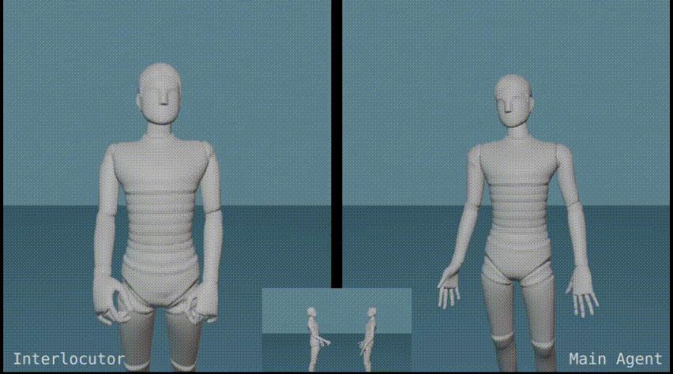

<!-- * B.S. in Communication Engineering, Hefei University of Technology, 2019
* M.S. in Computer Science and Technology, Harbin Institute of Technology, 2021
* Ph.D. in Computer Science and Technology, Harbin Institute of Technology, 2025 (expected) -->
Hi, this is Liangxiao Hu. I am a third-year (2021~) Ph.D. student in Faculty of Computing, Harbin Institute of Technology, advised by Prof. [Shengping Zhang](https://homepage.hit.edu.cn/zhangshengping).
My research focuses on **human-centered computer vision**, including motion capture, audio/text-driven human motion synthesis and the synthesis of digital humans, etc.

## Background

<table style="width:100%;border:none;border-spacing:0px;border-collapse:separate;margin-right:auto;margin-left:auto;font-size: large">
<tr>
<td style="padding:20px;width:25%;vertical-align:middle;border:none" align="center">
 
</td>
<td style="padding:20px;width:75%;vertical-align:middle;border: none" align="left">
Ph.D. Student. Sep. 2021 - Jun. 2025 (Expected) 
<a href="https://encs.hit.edu.cn//">Faculty of Computing</a> 
<a href="http://en.hit.edu.cn/">Harbin Institute of Technology</a> 
</td>
</tr>

<tr>
<td style="padding:20px;width:25%;vertical-align:middle;border:none" align="center">
 
</td>
<td style="padding:20px;width:75%;vertical-align:middle;border: none" align="left">
Master of Engineering. Sep. 2019 - Jun. 2021 
<a href="https://cst.hitwh.edu.cn//">School of Computer Science and Technology</a> 
<a href="https://www.hitwh.edu.cn/">Harbin Institute of Technology (Weihai)</a> 
</td>
</tr>

<tr>
<td style="padding:20px;width:25%;vertical-align:middle;border:none" align="center">
 
</td>
<td style="padding:20px;width:75%;vertical-align:middle;border: none" align="left">
Bachelor of Engineering. Sep. 2015 - Jun. 2019 
<a href="https://ci.hfut.edu.cn/English/Home.htm">School of Computer Science and Information Engineering</a> 
<a href="https://www.hfut.edu.cn/">Hefei University of Technology</a> 
</td>
</tr>
</table>    

## Research

<b>GaussianAvatar: Towards Realistic Human Avatar Modeling from a Single Video via Animatable 3D Gaussians</b> 
<b>Liangxiao Hu</b>, [Hongwen Zhang](https://zhanghongwen.cn/), [Yuxiang Zhang](https://zhangyux15.github.io/), [Boyao Zhou](https://morpheo.inrialpes.fr/people/zhou/), [Boning Liu](), [Shengping Zhang](http://homepage.hit.edu.cn/zhangshengping), [Liqiang Nie](https://liqiangnie.github.io/) 
IEEE Conference on Computer Vision and Pattern Recognition (<b>CVPR</b>),  2024 
[<i class="fas fa-fw fa-globe"></i>Project](https://huliangxiao.github.io/GaussianAvatar) /
[<i class="fas fa-fw fa-file-pdf"></i>Paper](https://arxiv.org/pdf/2312.02134.pdf) /
[<i class="fas fa-fw fa-video"></i>Video](https://www.youtube.com/watch?v=a4g8Z9nCF-k)/
[<i class="fab fa-fw fa-github fa-github"></i>Code](https://github.com/huliangxiao/GaussianAvatar) 

---

<b>ProxyCap: Real-time Monocular Full-body Capture in World Space via Human-Centric Proxy-to-Motion Learning</b> 
[Yuxiang Zhang](https://zhangyux15.github.io/), [Hongwen Zhang](https://hongwenzhang.github.io/), <b>Liangxiao Hu</b>, Jiajun Zhang, [Hongwei Yi](https://xyyhw.top/), [Shengping Zhang](http://homepage.hit.edu.cn/zhangshengping), [Yebin Liu](http://www.liuyebin.com/) 
IEEE Conference on Computer Vision and Pattern Recognition (<b>CVPR</b>),  2024 
[<i class="fas fa-fw fa-globe"></i>Project](https://zhangyux15.github.io/ProxyCapV2/) /
[<i class="fas fa-fw fa-file-pdf"></i>Paper](https://arxiv.org/pdf/2307.01200.pdf) 

---

<b>The DiffuGesture entry to the GENEA Challenge 2023: Generating Human Gesture From Two-person Dialogue With Diffusion Models</b> 
Weiyu Zhao, <b>Liangxiao Hu</b>, [Shengping Zhang](http://homepage.hit.edu.cn/zhangshengping) 
ACM International Conference on Multimodal Interaction (<b>ICMI</b>), 2023 Workshop 
[<i class="fas fa-fw fa-file-pdf"></i>Paper](https://openreview.net/forum?id=swc28UDR8Wk) /
[<i class="fas fa-fw fa-video"></i>Video](https://www.youtube.com/watch?v=pFpZceVLpck) 

---

<b>CaPhy: Capturing Physical Properties for Animatable Human Avatars</b> 
[Zhaoqi Su](https://suzhaoqi.github.io/), <b>Liangxiao Hu</b>, [Siyou Lin](https://jsnln.github.io/), [Hongwen Zhang](https://hongwenzhang.github.io/), [Shengping Zhang](http://homepage.hit.edu.cn/zhangshengping), [Justus Thies](https://justusthies.github.io/), [Yebin Liu](http://www.liuyebin.com/) 
IEEE International Conference on Computer Vision (<b>ICCV</b>), 2023 
[<i class="fas fa-fw fa-globe"></i>Project](https://suzhaoqi.github.io/projects/CaPhy/) /
[<i class="fas fa-fw fa-file-pdf"></i>Paper](https://arxiv.org/abs/2308.05925) 

## Award
+ National Scholarship, Ministry of Education of China, 2018

## Contact
E-mail: lx.hu[AT]hit.edu.cn 
